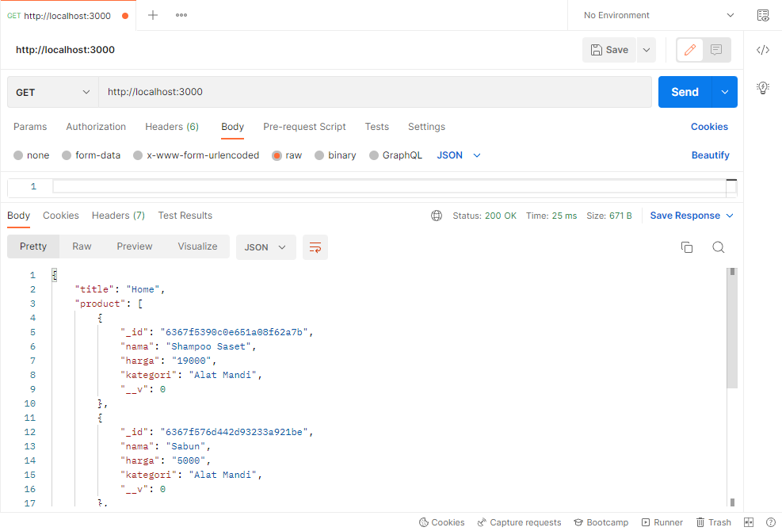
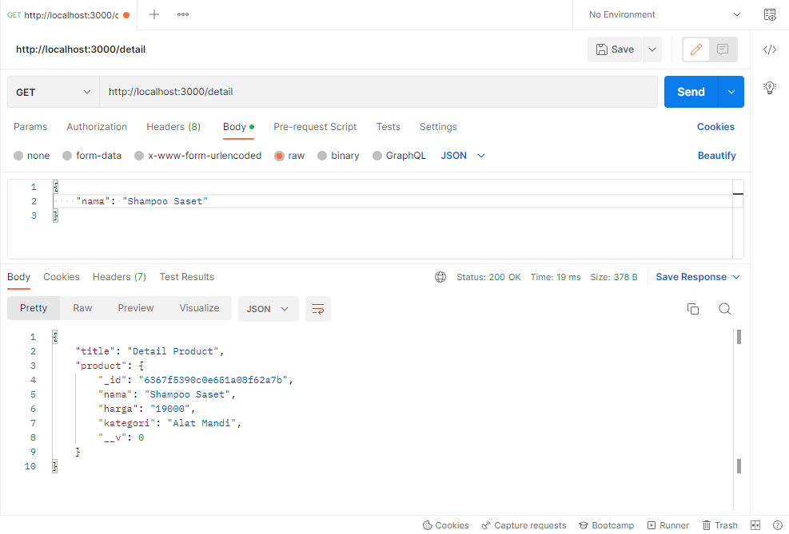
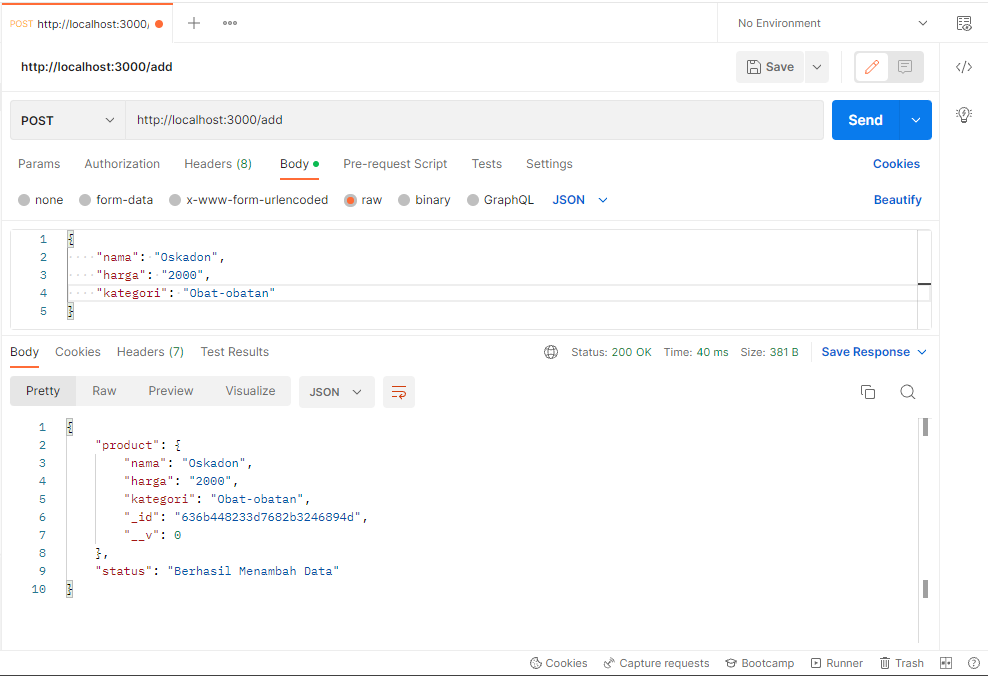
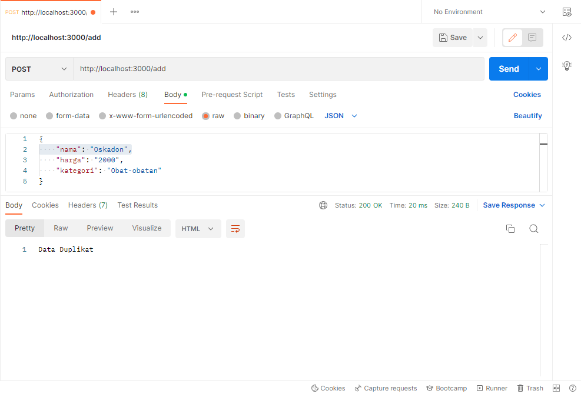
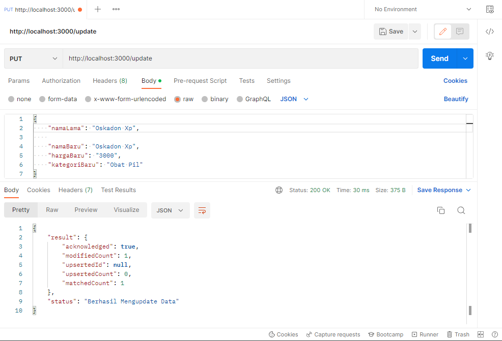
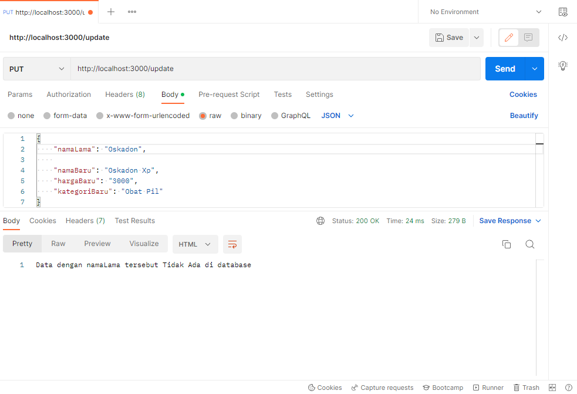
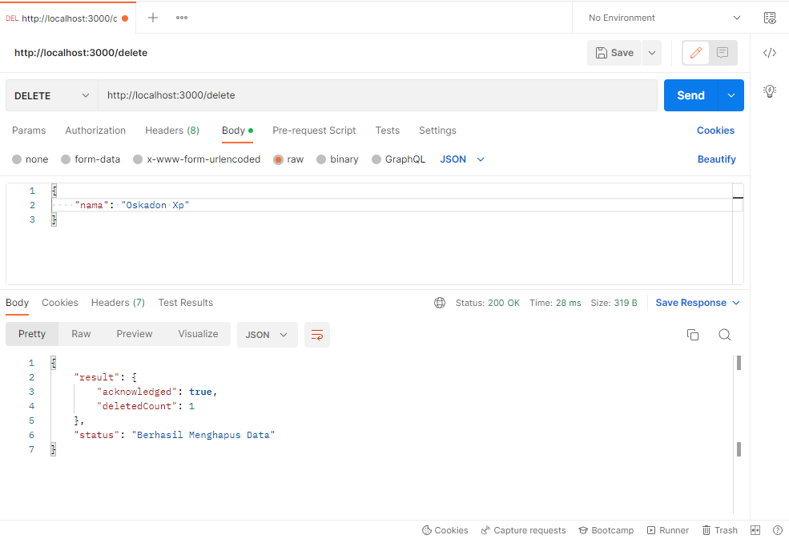

# Tugas 2 PWL

## Instalasi

1. Install Node.js <br>
Install node.js pada komputer anda dengan melihat pada link ini : https://nodejs.org/en/download/ <br>

2. Install MongoDB <br>
Install MongoDB pada komputer anda dengan melihat pada link ini : https://www.mongodb.com/try/download/community <br>

3. Download Source Code
   - Download ZIP <br>
ke Code kemudian Download ZIP

   - With Git <br>
      ```
      $ git clone https://github.com/mriskiaziz/tugas2-pwl.git
      ```
4. Starting
    ```
    $ npm install
    $ node app
    ```

## Tampilan
### Home
<div>
  
</div>

### Detail Product
<div>
  
</div>

### Tambah Product
<div>
  
  
</div>

### Update Product
<div>
  
  
</div>

### Delete Product
<div>
  
</div>


## Sumber
1. PPT Perkuliahan Pemrograman Web Lanjut 2022/2023
2. Exspress.js
3. MongoDB 
